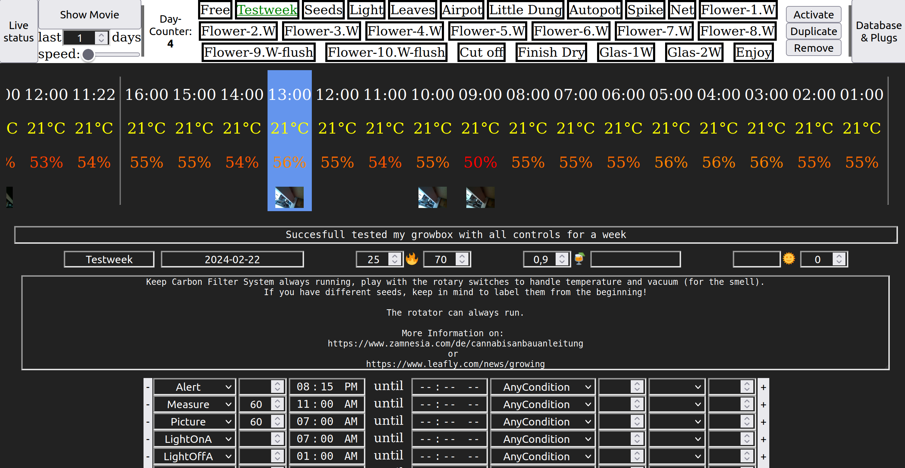
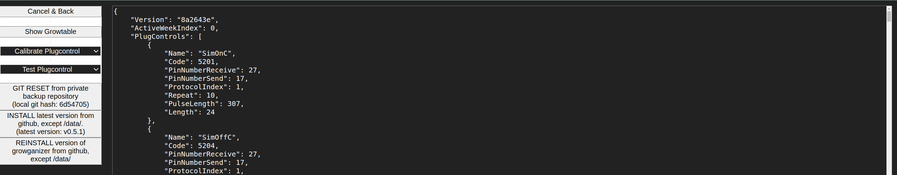
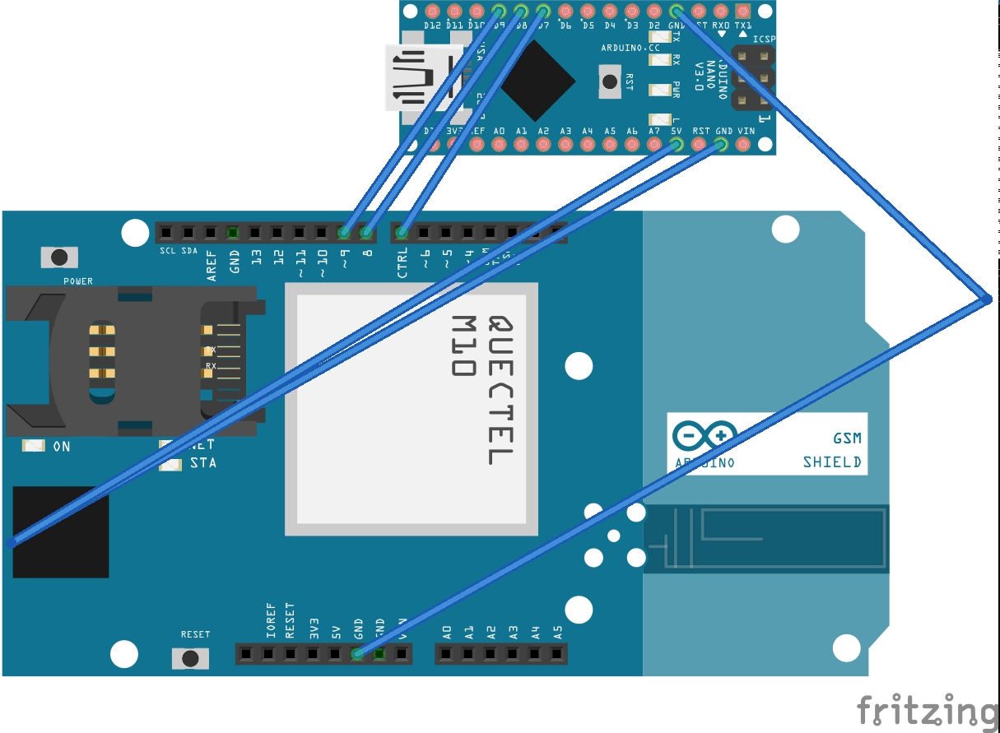

# Growmpage
To grow using a homepage results in a Growmpage, providing an all-round carefree growbox package.

<!-- Expert:
 -->

# Motivation
Don't care about my Growbox, because it cares about me!

I love creating helpful Code, giving access to quality cannabis!

Especially because of [Legalization in Germany](https://www.bundestag.de/dokumente/textarchiv/2023/kw42-de-cannabisgesetz-971376)

# Goal / Features
Creating an all-round carefree package for a quiet 1m² growbox for approx. 1000€.

- An inexpensive Raspberry Pi reads humidity, temperature and takes pictures
- To switch radio-controlled sockets for managing light for example, using a customizable Growcontroller which is based on past measurements
- With the help of a SIM module, you are always called free of charge as soon as manual intervention is required.
- And you can add new power sockets using the integrated growsniffer
- Shows description for every week of your grow, marking bad measurements based on optimal temperature and humidity
- Sharing your configuration (growganizer.json) is easy, go to "Database & Plugs", copy/paste, click on "Save". (TODO: Restore personal "PlugControls")
- One-click upgrade, automatic backups, movie of pictures, ...
- Keeping the code as vanilla as you can

# State
)

It runs fine on my Raspberry Pi Zero 2 W. But cannabis was illegal in Germany before April 2024, so this project was never shared before.
But it's still a lot to do and it's my first try with Go, so please help me by reporting any errors/suggestions/improvements here: [new Issue](https://github.com/growmpage/growmpage/issues/new), feel free to open a PR!

### Raspberry Pi - Get started

#### Install
Simply execute this line in your raspberry /home/pi/

    curl "https://raw.githubusercontent.com/growmpage/growmpage/main/INSTALL.sh" | sudo bash

##### (Optional) Enable daily git backup
- Pi's default username must be "pi", or replace in *.sh files
- Install git and create ssh key on pi:

        ssh pi@growmpage
        sudo apt install git -y
        ssh-keygen -t ed25519 -C "grower@growmpage.com"  #accept all with ENTER
        cat ~/.ssh/id_ed25519.pub  #copy to https://github.com/settings/ssh/new
        ssh -T git@github.com  #test

- Create a [new](https://github.com/new) private Repository, replace %SSHURL%:

        cd /home/pi/growmpage
        git init
        git remote add origin %SSHURL%

- Test:

        /home/pi/growmpage/scripts/git_private_backup.sh
        #script gets executed daily, see /etc/systemd/system/growmpage-backup.timer

##### (Optional) Pi Preparation:
- Install Raspberry Pi Imager:
   - Ubuntu: 
         
         sudo snap install rpi-imager
    - Windows:
    
        https://downloads.raspberrypi.org/imager/imager_latest.exe

- Run Raspberry Pi Imager:
  - CHOOSE OS: Raspberry Pi OS (Legazy, 32-bit) Lite
  - CHOOSE STORAGE: Insert SD-Memory-Card and select
  - Setting-Icon: hostname=growmpage, ssh with public-key, username=pi, password, WLAN.

- Insert SD in Pi, power up, and ssh into Pi:

      ssh pi@growmpage

- Pi Settings: 

      sudo raspi-config  #enable i2c and picam legacy under "3 Interface Options" TODO: command

#### Hardware
- Raspberry Pi needs 5V-2A power supply

##### 433Mhz Sender
* "\+" -> 5V
* "\-" -> GND
* "DATA" -> GPIO-17

##### 433Mhz Receiver
* "VCC" -> 5V
* "GND" -> GND
* "DATA" -> GPIO-27

- To enable phone call for monitoring, you can use an Arduino Nano and a SIM-Module:

  

    - Download Legacy IDE from https://www.arduino.cc/en/software
    - Install Arduino 1.8.19 with *sudo sh install.sh*
    - Use [Arduino code](docs/arduino.c) and for settings use:
        - Board: Arduino Nano
        - Processor: ATmega328P
        - Port: /dev/ttyUSB0
        - Programmer: AVRISP mkll

##### Shopping cart
* [Raspberry Pi Zero 2 W](https://www.amazon.de/Raspberry-Pi-Zero-2-W/dp/B09KLVX4RT/ref=sr_1_2?keywords=zero+2+w&qid=1704284508&sr=8-2)
* [Raspberry Power Supply](https://www.amazon.de/Raspberry-Netzteil-Ladeger%C3%A4t-Netzschalter-Kompatibel/dp/B07G953WC3/ref=sr_1_4?keywords=netzteil+5v+3a+usb&qid=1704284890&sr=8-4)
* [Raspberry SD](https://www.amazon.de/gp/product/B073K14CVB/ref=ppx_yo_dt_b_asin_title_o00_s00?ie=UTF8&psc=1)
* [Raspberry Jumper Wires](https://www.amazon.de/dp/B07KYHBVR7/?coliid=I2EG3536DCC8YH&colid=1MCC6B4CV7811&psc=1&ref_=cm_sw_r_cp_ud_lstpd_2SZTYQ5CQSNAM2HX19FF)
* [Power Plugs (1000W max, 1200W tested)](https://www.amazon.de/gp/product/B001AX8QUM/ref=ppx_yo_dt_b_asin_title_o04_s00?ie=UTF8&psc=1)
* [Power Plug Receiver/Tranceiver](https://www.amazon.de/gp/product/B071J2Z3YK/ref=ppx_yo_dt_b_asin_title_o05_s00?ie=UTF8&psc=1)
* [Kamera](https://www.amazon.de/dp/B07BVTDZH6/ref=cm_sw_r_tw_dp_U_x_dFQTDb2ESKCFK)
* [BME230 (temperature+humidity)](https://www.amazon.de/dp/B07D8T4HP6/ref=cm_sw_r_tw_dp_U_x_TrRWDbQG2J6DE)
* [Sim-Module](https://amazon.de/dp/B07D361WZV/ref=cm_sw_r_tw_dp_U_x_PnpEDb8GR2HGQ)
* Sim-Card: for example [Netzclub](https://www.netzclub.net/?utm_source=sea&utm_medium=google&utm_campaign=brand_allgemein&utm_content=netzclub_prepaid&utm_term=netzclub%20prepaid_e&gad_source=1&gclid=CjwKCAiAvdCrBhBREiwAX6-6UrDzJLmhhtwNo7ZHWipI9smGDU-Be9QQ4SU3QT4x1McwVeHbdMo-txoCshkQAvD_BwE)

### Growbox - Get started
#### Hardware

TODO: take new pictures

#### Shopping cart
* [Growbox](https://www.grow-shop24.de/low-budget-led-growbox-komplettset-s-80x80x180cm)
* [Controller](https://amazon.de/dp/B00FJ5AQFA/ref=cm_sw_r_tw_dp_U_x_zZ1pDb9X1TFJK)
* [Water measuring devices](https://grow-shop24.de/ph-ec-set-messung)
* [Airpot](https://grow-shop24.de/Air-PotZ-Superoot-3-L)
* [AutoPot](https://autopot-systeme.de/produkt/autopot-2pot-xxl-system-mit-35l-oder-50l-flexipot-inkl-47l-wasserfass/)
* [Socket strip](https://amazon.de/gp/product/B000YBXU6G/ref=ppx_yo_dt_b_search_asin_title?ie=UTF8&psc=1)

* [Soil+Fertilizer](https://grow-shop24.de/erdeset-xs-s)

* [Only Soil](https://grow-shop24.de/biobizz-light-mix-50-l)
* [Only Torquelltöpfe](https://grow-shop24.de/jiffy-torfquelltoepfe)
* [Only Fertilizer](https://grow-shop24.de/canna-duengerset-basis)

* [Pebbles](https://www.grow-shop24.de/blaehton-canna-clay-pebbles-tongranulat-45l)
* [Gelbtafeln](https://grow-shop24.de/gelbtafeln-gelbsticker)
* [Bamboo stick](https://grow-shop24.de/Bambusstock-60cm)
* [Labels](https://grow-shop24.de/romberg-schildetiketten)

* [Sieve ?](https://amazon.de/gp/product/B0751BTQYS/ref=ppx_yo_dt_b_asin_title_o09_s00?ie=UTF8&psc=1)
* [Scissors](https://amazon.de/gp/product/B01MT4BTEI/ref=ppx_yo_dt_b_asin_title_o03_s00?ie=UTF8&psc=1)
* [Microscope](https://amazon.de/gp/product/B00LAX52IQ/ref=ppx_yo_dt_b_asin_title_o04_s00?ie=UTF8&psc=1)

* [Alcohol](https://amazon.de/gp/product/B01N39PVPT/ref=ppx_yo_dt_b_asin_title_o04_s00?ie=UTF8&psc=1)
* [Glasses](https://amazon.de/gp/product/B01NCVKDBN/ref=ppx_yo_dt_b_asin_title_o07_s00?ie=UTF8&psc=1)
* [Moisture bag](https://amazon.de/gp/product/B00TU03HU6/ref=ppx_yo_dt_b_search_asin_title?ie=UTF8&psc=1)

* [PH 7](https://grow-shop24.de/milwaukee-ph-eichloesung-7-01-ph-20-ml)
* [PH 4](https://grow-shop24.de/milwaukee-ph-eichloesung-4-01-ph-20-ml)
* [EC 1,4](https://grow-shop24.de/milwaukee-ec-eichloesung-1-413-ms-cm-20-ml)
* [Seeds](https://zamnesia.com/295-feminized-cannabis-seeds)
* [Ventilator (every 2 grows)](https://grow-shop24.de/ghp-clipventilator-15cm-5w)
* [Activated carbon filter (every 4 grows)](https://grow-shop24.de/Aktivkohlefilter-Prima-Klima-Eco-Line-K2600-mini-160-240ml-h-100mm-Anschluss)

* [Dehumidifier (should auto-start if having power)](https://www.amazon.de/dp/B01N0ZUSAT/ref=cm_sw_r_tw_dp_U_x_s0XIDbAKHCQ0H) 
* [Humidifier (should auto-start if having power)](https://www.amazon.de/dp/B01A9VPJ50/ref=cm_sw_r_tw_dp_U_x_Y1XIDbEBD3608)

* Distilled water: DIY store or petrol station
* Styrofoam (DIY store 2x 2x50x100) Under pots: 70x50x2 and pedestal for water tank: 20x30x20 (LxWxH in cm)

##### Troubleshoot
- Multiple ssh keys:

  https://gist.github.com/jexchan/2351996

   - ERROR: Repository not found:

        sudo nano ~/.ssh/config

Host mygit.com
  HostName github.com
  User git
  IdentityFile ~/.ssh/id_ed25519

   - cd to growmpage directory:

         git remote set-url origin "mygit.com:growmpage/growmpage.git"

  
   - restart terminal

- Use this script to test, build and update your Raspberry Pi
   - requires step above: enabling git auto backup

         cd PATH/TO/LOCAL/REPOSITORY/growmpage
         ./RELEASE_PRIVAT.sh

   - Because of relative paths, all test code must run in the working directory */cmd*
   - the script runs *go test /cmd/package -c* for every package to create a test binary under */cmd*, then executing each one with *./package.test
   - TODO: set working directory for VSCode or modify/static paths for testing

https://forum.cannabisanbauen.net/t/der-ultimative-grow-guide-fuer-anfaenger-2024-edition-endlich-legal/9439/46